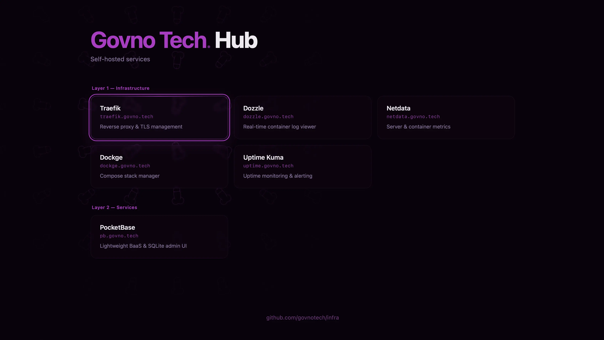

# Server Infrastructure

> Minimum specs: **4 vCPU / 8 GB RAM / 160 GB NVMe SSD**, Ubuntu 22.04 LTS or Debian 12.

Starting from a bare server? Do the [initial host setup](#appendix--fresh-server-setup) first, then continue with the Quick Start below.



## Table of Contents

- [Quick Start](#quick-start)
- [Access Model](#access-model)
- [Layer 0 — Network](#layer-0--network)
  - [Cloudflare](#cloudflare)
  - [Tailscale](#tailscale)
- [Layer 1 — Infrastructure](#layer-1--infrastructure)
  - [Watchtower](#watchtower)
  - [Traefik](#traefik)
  - [PostgreSQL (shared)](#postgresql-shared)
  - [Dozzle](#dozzle)
  - [Netdata](#netdata)
  - [Dockge](#dockge)
  - [Uptime Kuma](#uptime-kuma)
  - [Hub](#hub)
- [Layer 2 — Services](#layer-2--services)
  - [OpenPanel](#openpanel)
  - [PocketBase](#pocketbase)
- [Layer 3 — Applications](#layer-3--applications)
- [Appendix — Fresh Server Setup](#appendix--fresh-server-setup)

---

## Quick Start

1. Clone the repository into `/opt/infra` on the server (the clone uses SSH — set up the [SSH key](#9-github-ssh-key) first). `/opt` is owned by `root`, so create the directory and hand it to your admin user first — then everything below runs without `sudo`:

   ```bash
   sudo mkdir -p /opt/infra
   sudo chown $USER:$USER /opt/infra
   git clone git@github.com:govnotech/infra.git /opt/infra
   cd /opt/infra
   ```

   `/opt/<package>` is the FHS-canonical home for self-contained add-on software. Services bind-mount their data relative to each compose directory, so a stable, well-known location keeps volumes and backups predictable. [Layer 3](#layer-3--applications) apps follow the same pattern — each clones into its own `/opt/<app>` or `/opt/<namespace>/<app>`.

2. Copy `.env.example` to `.env` and fill in the values:

   ```bash
   cp .env.example .env
   ```

3. Launch services with the interactive launcher:

   ```bash
   ./start
   ```

   Use `↑`/`↓` to navigate, `SPACE` to select, `ENTER` to launch. Dependencies are resolved automatically — selecting n8n, for example, auto-selects Traefik and PostgreSQL.

   **Manual alternative** — run each service directly from the repo root (`--env-file .env` is required because Docker Compose v2 resolves `.env` relative to the compose file, not cwd):

   ```bash
   docker compose --env-file .env -f compose/watchtower/compose.yml up -d
   docker compose --env-file .env -f compose/traefik/compose.yml up -d
   # …
   ```

**Image versioning:** Critical services (PostgreSQL, Redis) are pinned to a major version (e.g. `postgres:16`) — [Watchtower](#watchtower) updates patch/minor releases but never jumps to a new major. Non-critical services (Dozzle, Watchtower itself) use `latest`.

Private services route through the `tailscale` Traefik entrypoint — DNS for their subdomains points to `TRAEFIK_TAILSCALE_IP` (Cloudflare grey cloud), so they are only reachable from within the Tailscale network.

---

## Access Model

Three access tiers. Each service belongs to exactly one.

| Service | Tier | How |
| ----------------------------- | ----------------- | -------------------------------------------------------- |
| SaaS front-ends, public sites | Public (proxied) | Cloudflare orange cloud → Traefik |
| OpenPanel event ingestion | Public (proxied) | Cloudflare orange cloud → Traefik |
| API backends | Public (DNS-only) | Cloudflare grey cloud → Traefik |
| All admin / dashboard UIs | Private | Cloudflare grey cloud → Traefik (`tailscale` entrypoint) |

**Cloudflare proxy (orange cloud)** — hides origin IP, adds CDN and DDoS protection.
**Cloudflare DNS-only (grey cloud)** — plain DNS, no proxy. Used for webhooks, API backends, and private services (DNS points to Tailscale IP).
**Tailscale** — WireGuard VPN mesh. Private services use a dedicated Traefik entrypoint bound to the Tailscale IP — only reachable from within the tailnet.

---

## Layer 0 — Network

### Cloudflare

`Layer 0` · [dash.cloudflare.com](https://dash.cloudflare.com) · [Docs](https://developers.cloudflare.com/dns/)

DNS provider, CDN, and DDoS protection. Configured entirely in the dashboard — no server-side installation.

**Setup:**

1. Add your domain to Cloudflare and point nameservers.
2. Create an `A` record pointing your apex/subdomain to the VPS IP.
3. Set orange cloud (proxied) for public-facing services; grey cloud (DNS-only) for webhooks, API backends, and private services (point to `TRAEFIK_TAILSCALE_IP`).
4. In **SSL/TLS → Overview**, set mode to **Full (strict)**.
5. Create an API token for `CF_DNS_API_TOKEN`: **My Profile → API Tokens → Create Token → Edit zone DNS** (use the template) → set **Zone Resources** to your domain → **Create Token**.

### Tailscale

`Layer 0` · [login.tailscale.com/admin](https://login.tailscale.com/admin) · [Docs](https://tailscale.com/kb/) · [GitHub](https://github.com/tailscale/tailscale)

WireGuard-based VPN mesh. Connects the VPS, your Mac, and any other devices. Used to restrict access to private services — Traefik's `tailscale` entrypoint is bound to the Tailscale IP, so private subdomains are only reachable from within the tailnet.

**Setup:**

```bash
curl -fsSL https://tailscale.com/install.sh | sh

# Authenticate the server (use an auth key from the Tailscale admin console)
tailscale up --authkey=<auth-key>
```

Enable **MagicDNS** in the admin console under DNS settings.

---

## Layer 1 — Infrastructure

_Sorted by deployment priority — each service may be a prerequisite for those that follow._

### Watchtower

`Layer 1` · [Docs](https://containrrr.dev/watchtower/) · [GitHub](https://github.com/containrrr/watchtower)

**Prerequisites:** Docker.

**Deploy:** [`compose/watchtower/compose.yml`](compose/watchtower/compose.yml)

Automatically pulls and restarts containers when new images are published. Deploy first — covers all services that follow.

**Required in `.env`:** `WATCHTOWER_SCHEDULE` — see [`.env.example`](.env.example).

By default, watches all containers. Use `--label-enable` to opt-in specific containers instead.

### Traefik

`Layer 1` · [Docs](https://doc.traefik.io/traefik/) · [GitHub](https://github.com/traefik/traefik)

**Prerequisites:** [Cloudflare](#cloudflare) API token, [Tailscale](#tailscale), `traefik` Docker network.

**Deploy:** [`compose/traefik/compose.yml`](compose/traefik/compose.yml)

Reverse proxy for all public-facing services. Handles TLS termination via Let's Encrypt (DNS-01 challenge through [Cloudflare](#cloudflare)). Routes requests to containers using Docker labels.

```bash
docker network create traefik
```

**Required in `.env`:** `CF_DNS_API_TOKEN`, `ACME_EMAIL`, `TRAEFIK_PUBLIC_IP`, `TRAEFIK_TAILSCALE_IP`, `DOMAIN` — see [`.env.example`](.env.example).

Two entrypoints:

- `websecure` — bound to `TRAEFIK_PUBLIC_IP:443`, for public services.
- `tailscale` — bound to `TRAEFIK_TAILSCALE_IP:443`, for private services. DNS for private subdomains must point to `TRAEFIK_TAILSCALE_IP` (Cloudflare grey cloud).

Any service must join the `traefik` network and carry `traefik.enable=true` labels. Public services use `entrypoints: websecure`, private services use `entrypoints: tailscale`.

### PostgreSQL (shared)

`Layer 1` · [Docs](https://www.postgresql.org/docs/) · [GitHub](https://github.com/postgres/postgres)

**Prerequisites:** Docker.

**Deploy:** [`compose/postgres/compose.yml`](compose/postgres/compose.yml)

Single PostgreSQL instance shared by [Umami](#umami), [Hoppscotch](#hoppscotch), [Penpot](#penpot), and any other services that need a relational DB. Each service gets its own database and user.

**Required in `.env`:** `POSTGRES_USER`, `POSTGRES_PASSWORD` — see [`.env.example`](.env.example).

Create per-service databases after first start:

```bash
docker exec -it postgres psql -U $POSTGRES_USER
```

```sql
CREATE DATABASE umami;
CREATE USER umami_user WITH PASSWORD '...';
GRANT ALL PRIVILEGES ON DATABASE umami TO umami_user;
```

### Dozzle

`Layer 1` · [Docs](https://dozzle.dev/guide/what-is-dozzle) · [GitHub](https://github.com/amir20/dozzle)

**Prerequisites:** [Traefik](#traefik) (private UI).

**Deploy:** [`compose/dozzle/compose.yml`](compose/dozzle/compose.yml)

Real-time log viewer for all running containers. Read-only Docker socket access.

### Netdata

`Layer 1` · [Docs](https://learn.netdata.cloud) · [GitHub](https://github.com/netdata/netdata)

**Prerequisites:** [Traefik](#traefik) (private UI).

**Deploy:** [`compose/netdata/compose.yml`](compose/netdata/compose.yml)

Server and per-container metrics with zero configuration. Auto-discovers running containers. ML-based anomaly detection and alerting.

Configure a notification channel (Telegram, email) in `netdata.conf` or via the UI to receive alerts.

### Dockge

`Layer 1` · [Docs](https://github.com/louislam/dockge) · [GitHub](https://github.com/louislam/dockge)

**Prerequisites:** [Traefik](#traefik) (private UI).

**Deploy:** [`compose/dockge/compose.yml`](compose/dockge/compose.yml)

Visual manager for Docker Compose stacks. Useful for spinning up temporary stacks without SSH.

Stacks are stored in `compose/dockge/stacks/` — no configuration needed.

### Uptime Kuma

`Layer 1` · [Docs](https://github.com/louislam/uptime-kuma/wiki) · [GitHub](https://github.com/louislam/uptime-kuma)

**Prerequisites:** [Traefik](#traefik) (private UI).

**Deploy:** [`compose/uptime-kuma/compose.yml`](compose/uptime-kuma/compose.yml)

Uptime monitoring for external URLs. Sends alerts via Telegram or email when a service goes down.

### Hub

`Layer 1` · [GitHub](https://github.com/nginx/nginx) · [`compose/hub/compose.yml`](compose/hub/compose.yml)

**Prerequisites:** [Traefik](#traefik) (private UI).

**Deploy:** [`compose/hub/compose.yml`](compose/hub/compose.yml)

Private homepage listing all self-hosted services with links. Served by nginx:alpine from a single static HTML file — no build step, no external dependencies. The page derives the base domain from `window.location.hostname` at runtime, so no env vars are needed beyond `DOMAIN` (already required by Traefik).

All service URLs are displayed as `{subdomain}.DOMAIN` and open in the same tab on click. The service list is hardcoded in the `layer1` / `layer2` arrays inside `compose/hub/index.html` — update it manually when adding or removing a service.

---

## Layer 2 — Services

_Sorted alphabetically._

### OpenPanel

`Layer 2` · [Docs](https://openpanel.dev/docs) · [GitHub](https://github.com/Openpanel-dev/openpanel)

**Prerequisites:** [Traefik](#traefik) (event ingestion), [Tailscale](#tailscale) (dashboard).

**Deploy:** [`compose/openpanel/compose.yml`](compose/openpanel/compose.yml)

Open-source product & web analytics — funnels, retention, user journeys, event tracking. Mixpanel/PostHog alternative. Bundles its own Postgres, Redis (BullMQ queue) and ClickHouse — not connected to the shared instances because OpenPanel pins exact versions and runs Redis with `noeviction` for job durability.

Single host `op.DOMAIN`:

- Dashboard — private, tailscale entrypoint only.
- `/api` (event ingestion) — public, both `websecure` and `tailscale` entrypoints. Traefik strips the `/api` prefix before forwarding to `op-api`.

**Required in `.env`:** `OPENPANEL_COOKIE_SECRET`, `OPENPANEL_ALLOW_REGISTRATION` — see [`.env.example`](.env.example). Generate the cookie secret:

```bash
openssl rand -hex 32
```

**Bootstrap (one-time):**

1. Start with `OPENPANEL_ALLOW_REGISTRATION=true`, open `https://op.DOMAIN` from within the tailnet, create the first account.
2. Set `OPENPANEL_ALLOW_REGISTRATION=false` in `.env` and restart openpanel (email-based invitations are disabled — only existing accounts can sign in).

**DNS:** `op.DOMAIN` needs an `A` record on `TRAEFIK_TAILSCALE_IP` (grey cloud) for the dashboard. For public event ingestion from browsers, add a second `A` record on `TRAEFIK_PUBLIC_IP` (orange cloud) — Traefik picks the right entrypoint automatically.

### PocketBase

`Layer 2` · [Docs](https://pocketbase.io/docs/) · [GitHub](https://github.com/pocketbase/pocketbase)

**Prerequisites:** [Traefik](#traefik) (public API), [Tailscale](#tailscale) (admin UI).

**Deploy:** [`compose/pocketbase/compose.yml`](compose/pocketbase/compose.yml)

Lightweight BaaS: SQLite, built-in auth, realtime subscriptions, file storage, admin UI. Single binary, ~30 MB RAM. Use for MVPs and small projects.

---

## Layer 3 — Applications

Custom applications deployed on this server. Each app connects to shared infrastructure ([Traefik](#traefik), [PostgreSQL](#postgresql-shared)) defined in Layers 0–2.

_This layer is out of scope for this repository — each application lives in its own repository with its own compose configuration._

---

## Appendix — Fresh Server Setup

Bootstrapping a freshly-provisioned server up to the point where the stack above can be deployed.

> Everything below was run on **Ubuntu 26.04 LTS**; current as of **2026-07-05**. Commands are run as `root` unless already prefixed with `sudo`. Replace the placeholders with your own — `vovarevenko` (admin username), `SERVER_IP` (server IP), `govno-01` (hostname).

### 1. Update & reboot

```bash
apt update && apt upgrade -y
reboot
```

### 2. Create a sudo user

Avoid working as `root` — create a personal user, grant sudo, and copy the SSH keys so you can log in as them:

```bash
adduser vovarevenko
usermod -aG sudo vovarevenko
rsync --archive --chown=vovarevenko:vovarevenko ~/.ssh /home/vovarevenko
```

Reconnect as the new user and confirm sudo works:

```bash
ssh vovarevenko@SERVER_IP
sudo whoami # → root
```

### 3. Harden SSH

Edit `/etc/ssh/sshd_config`:

```txt
PermitRootLogin no
PasswordAuthentication no
KbdInteractiveAuthentication no
PubkeyAuthentication yes
X11Forwarding no
AllowUsers vovarevenko
```

`AllowUsers vovarevenko` — only listed users may connect. Add any future deploy/CI user explicitly (`AllowUsers vovarevenko deploy`), otherwise they will be refused.

Validate, reload, and **verify login in a second terminal before closing the current session**:

```bash
sudo sshd -t
sudo systemctl reload ssh
sudo sshd -T | grep -E 'permitrootlogin|passwordauthentication|kbdinteractiveauthentication|pubkeyauthentication|x11forwarding|allowusers'
```

### 4. Firewall (UFW)

```bash
sudo ufw default deny incoming
sudo ufw default allow outgoing
sudo ufw allow OpenSSH
sudo ufw enable
sudo ufw status verbose
```

> **No need to `ufw allow` the web ports.** Docker publishes container ports (Traefik's `80`/`443`) through its own iptables rules that sit ahead of UFW — they work without a UFW rule, and UFW can't block them either. Here UFW only guards host services like SSH.

### 5. Unattended security upgrades

```bash
sudo apt install -y unattended-upgrades
sudo dpkg-reconfigure unattended-upgrades
```

Verify (both values should be `1`):

```bash
cat /etc/apt/apt.conf.d/20auto-upgrades
```

### 6. Fail2ban

Blocks brute-force SSH scans even with password auth disabled.

```bash
sudo apt install -y fail2ban
sudo systemctl enable --now fail2ban
```

Create `/etc/fail2ban/jail.d/sshd.local`:

```ini
[sshd]
enabled = true
backend = systemd
maxretry = 5
findtime = 10m
bantime = 1h
```

Apply and confirm the jail is live:

```bash
sudo systemctl restart fail2ban
sudo fail2ban-client status sshd
```

`status sshd` shows the failed/banned counters and the `Journal matches` line — if you see it, the config applied.

### 7. Hostname, timezone, swap

Check the current values:

```bash
hostnamectl
timedatectl
```

Change them if needed — pick a hostname, keep the clock on UTC:

```bash
sudo hostnamectl set-hostname govno-01
sudo timedatectl set-timezone UTC
```

> Keep the server on **UTC** — no DST jumps, cleaner logs, cron, and backups. Handle user- and business-local time in the application layer, not the OS clock.

Every container sets a `mem_limit`, but on an 8 GB box those ceilings intentionally overcommit and databases can still spike past their own limit (OpenPanel's ClickHouse, MongoDB, Postgres, the `noeviction` Redis). Keep a small swap as a backstop, with low swappiness so hot DB pages stay in RAM and swap is only touched under real pressure — a brief spike then pages out instead of triggering an OOM kill. Add it if none exists (check with `swapon --show` or `free -h`):

```bash
sudo fallocate -l 4G /swapfile
sudo chmod 600 /swapfile
sudo mkswap /swapfile
sudo swapon /swapfile
echo '/swapfile none swap sw 0 0' | sudo tee -a /etc/fstab
echo 'vm.swappiness=10' | sudo tee /etc/sysctl.d/99-swappiness.conf
sudo sysctl --system
```

> The `mem_limit`s and swap are complementary: the limits contain a runaway to its own container (surgical OOM, not a random victim), while swap absorbs the brief legitimate spikes.

### 8. Install Docker

Use the official apt repository ([docs](https://docs.docker.com/engine/install/ubuntu/#install-using-the-repository)) — not `apt install docker.io`.

Run Docker without `sudo` — note the `docker` group is effectively root-level access, which is fine for a single-admin server:

```bash
sudo usermod -aG docker vovarevenko
```

Log out and back in for the group to take effect, then verify:

```bash
docker compose version
docker run --rm hello-world
```

### 9. GitHub SSH key

The [Quick Start](#quick-start) clones over SSH. Use one **account-level key** — it reaches every repo you own (including [Layer 3](#layer-3--applications) apps) with no per-repo setup.

```bash
sudo apt install -y git
ssh-keygen -t ed25519 -C "govno-01" -f ~/.ssh/github -N ""
```

A non-default filename needs a `~/.ssh/config` entry so SSH uses it. Open it:

```bash
nano ~/.ssh/config
```

and add:

```txt
Host github.com
  IdentityFile ~/.ssh/github
  IdentitiesOnly yes
```

Print the public key, copy it, and add it at GitHub → **Settings → SSH and GPG keys → New SSH key**:

```bash
cat ~/.ssh/github.pub
```

Verify:

```bash
ssh -T git@github.com # → "Hi <username>! You've successfully authenticated…"
```

The server is now ready for the [Quick Start](#quick-start) above.
